# TripleCross


TripleCross is a Linux eBPF rootkit that demonstrates the offensive capabilities of the eBPF technology.

TripleCross is inspired by previous implant designs in this area, notably the works of Jeff Dileo at DEFCON 27[^1], Pat Hogan at DEFCON 29[^2], Guillaume Fournier and Sylvain Afchain also at DEFCON 29[^3], and Kris Nóva's Boopkit[^4]. We reuse and extend some of the techniques pioneered by these previous explorations of the offensive capabilities of eBPF technology.

This rootkit was created for my Bachelor's Thesis at UC3M. More details about its design are provided in the [thesis document](https://github.com/h3xduck/TripleCross/blob/master/docs/ebpf_offensive_rootkit_tfg.pdf).

### Disclaimer
This rookit is **purely for educational and academic purposes**. The software is provided "as is" and the authors are not responsible for any damage or mishaps that may occur during its use.

Do not attempt to use TripleCross to violate the law. Misuse of the provided software and information may result in criminal charges.

## Contents
1. [Features](#features)
2. [TripleCross overview](#triplecross-overview)
3. [Build and install](#build-and-install)
4. [Library injection module](#library-injection-module)
5. [Backdoor and C2](#backdoor-and-c2)
6. [Execution hijacking module](#execution-hijacking-module)
7. [Rootkit persistence](#rootkit-persistence)
8. [Rootkit stealth](#rootkit-stealth)
9. [License](#license)


## Features
1. A **library injection** module to execute malicious code by writing at a process' virtual memory.
2. An **execution hijacking** module that modifies data passed to the kernel to execute malicious programs.
3. A **local privilege escalation** module that allows for running malicious programs with root privileges.
4. A **backdoor with C2** capabilities that can monitor the network and execute commands sent from a remote rootkit client. It incorporates multiple activation triggers so that these actions are transmitted stealthily.
5. A **rootkit client** that allows an attacker to establish 3 different types of shell-like connections to send commands and actions that control the rootkit state remotely.
6. A **persistence** module that ensures the rootkit remains installed maintaining full privileges even after a reboot event.
7. A **stealth** module that hides rootkit-related files and directories from the user.


[^1]: J. Dileo. Evil eBPF: Practical Abuses of an In-Kernel Bytecode Runtime. DEFCON 27. [slides](https://raw.githubusercontent.com/nccgroup/ebpf/master/talks/Evil_eBPF-DC27-v2.pdf)
[^2]: P. Hogan. Warping Reality: Creating and Countering the Next Generation of Linux Rootkits using eBPF. DEFCON 27. [presentation](https://www.youtube.com/watch?v=g6SKWT7sROQ)
[^3]: G. Fournier and S. Afchain. eBPF, I thought we were friends! DEFCON 29. [slides](https://media.defcon.org/DEF%20CON%2029/DEF%20CON%2029%20presentations/Guillaume%20Fournier%20Sylvain%20Afchain%20Sylvain%20Baubeau%20-%20eBPF%2C%20I%20thought%20we%20were%20friends.pdf)
[^4]: Kris Nóva. Boopkit. [github](https://github.com/kris-nova/boopkit)

## TripleCross overview
The following figure shows the architecture of TripleCross and its modules.


The raw sockets library RawTCP_Lib used for rootkit transmissions is of my authorship and has [its own repository](https://github.com/h3xduck/RawTCP_Lib).

The following table describes the main source code files and directories to ease its navigation:
| DIRECTORY  | COMMAND |
| ------------- | ------------- |
| docs  | Original thesis document |
| src/client | Source code of the rootkit client |
| src/client/lib | RawTCP_Lib shared library |
| src/common | Constants and configuration for the rootkit. It also includes the implementation of elements common to the eBPF and user space side of the rootkit, such as the ring buffer |
| src/ebpf | Source code of the eBPF programs used by the rootkit |
| src/helpers | Includes programs for testing the functionality of several rootkit modules, and also the malicious program and library used at the execution hijacking and library injection modules, respectively |
| src/libbpf | Contains the libbpf library integrated with the rootkit|
| src/user | Source code of the userland programs used by the rootkits|
| src/vmlinux |  Headers containing the definition of kernel data structures (this is the recommended method when using libbpf) |


### Build and Install
#### Compilation
The rootkit source code is compiled using two Makefiles.
```
# Build rootkit
cd src
make all
# Build rootkit client
cd client
make
```
The following table describes the purpose of each Makefile in detail:

| MAKEFILE  | COMMAND | DESCRIPTION | RESULTING FILES |
| ------------- | ------------- | ------------- | ------------- |
| src/client/Makefile  | make  | Compilation of the rootkit client | src/client/injector |
| src/Makefile  | make help  | Compilation of programs for testing rootkit capabilities, and the malicious program and library of the execution hijacking and library injection modules, respectively | src/helpers/simple_timer, src/helpers/simple_open, src/helpers/simple_execve, src/helpers/lib_injection.so, src/helpers/execve_hijack |
| src/Makefile | make kit | Compilation of the rootkit using the libbpf library | src/bin/kit |
| src/Makefile | make tckit | Compilation of the rootkit TC egress program | src/bin/tc.o |

### Installation
Once the rootkit files are generated under src/bin/, the *tc.o* and *kit* programs must be loaded in order. In the following example, the rootkit backdoor will operate in the network interface *enp0s3*:
```
// TC egress program
sudo tc qdisc add dev enp0s3 clsact
sudo tc filter add dev enp0s3 egress bpf direct-action obj bin/tc.o sec classifier/egress
// Libbpf-powered rootkit
sudo ./bin/kit -t enp0s3
```

### Attack scenario scripts
There are two scripts, *packager&#46;sh* and *deployer&#46;sh*, that compile and install the rootkit automatically, just as an attacker would do in a real attack scenario. 

* Executing packager&#46;sh will generate all rootkit files under the *apps/* directory.

* Executing deployer&#46;sh will install the rootkit and create the persistence files.

These scripts must first be configured with the following parameters for the proper functioning of the persistence module:
| SCRIPT | CONSTANT | DESCRIPTION |
| ------------- | ------------- | ------------- |
| src/helpers/deployer.sh | CRON_PERSIST | Cron job to execute after reboot |
| src/helpers/deployer.sh | SUDO_PERSIST | Sudo entry to grant password-less privileges |

## Library injection module
The rootkit can hijack the execution of processes that call the *sys_timerfd_settime* or *sys_openat* system calls. This is achieved by overwriting the Global Offset Table (GOT) section at the virtual memory of the process making the call. This leads to a malicious library (*src/helpers/injection_lib.c*) being executed. The library will spawn a reverse shell to the attacker machine, and then returns the flow of execution to the original function without crashing the process.

TripleCross is prepared to bypass common ELF hardening techniques, including:
* ASLR
* Stack canaries
* DEP/NX
* PIE
* Full RELRO

It is also prepared to work with Intel CET-compatible code.

The module functionality can be checked using two test programs *src/helpers/simple_timer.c* and *src/helpers/simple_open.c*. Alternatively you may attempt to hijack any system process (tested and working with systemd).

The module configuration is set via the following constants:

| FILENAME | CONSTANT | DESCRIPTION |
| ------------- | ------------- | ------------- |
| src/common/constants.h | TASK_COMM_NAME_INJECTION_<br>TARGET_TIMERFD_SETTIME | Name of the process to hijack at syscall sys_timerfd_settime |
| src/common/constants.h | TASK_COMM_NAME_INJECTION_<br>TARGET_OPEN | Name of the process to hijack at syscall sys_openat |
| src/helpers/injection_lib.c| ATTACKER_IP & ATTACKER_PORT| IP address and port of the attacker machine|

Receiving a reverse shell from the attacker machine can be done with netcat:
```
nc -nlvp <ATTACKER_PORT>
```

### Library injection via GOT hijacking technique
The technique incorporated in TripleCross consists of 5 stages:

#### Locating GOT and the return address
The rootkit hooks the system call using a tracepoint program. From there, it locates the address at the GOT section which the PLT stub used to make the call to the glibc function responsible of the syscall. 

In order to reach the GOT section, the eBPF program uses the return address stored at the stack. Note that:
* The .text makes a *call* to the .plt, so *rip* is saved as *ret* in the stack.
* The .plt makes a *jump* to glibc using .got, so no other *rip* is saved. It also does not modify or save the value of *rbp*.
* Glibc makes a *syscall*, which does not save *rip* in the stack, but rather saves it in *rcx*. 

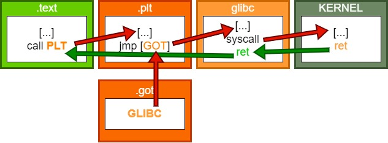

Therefore in order to check from eBPF that an address in the stack is the return address that will lead us to the correct GOT, we must check that it is the return address of the PLT stub that uses the GOT address that jumps to the glibc function making the system call we hooked from eBPF.

Two techniques for finding the return address have been incorporated:
* With sys_timerfd_settime, the eBPF program scans forward in the scan using the syscall arguments.
* With sys_openat, the eBPF program scans uses the data at tracepoints' *pt_regs* struct for scanning the return address.

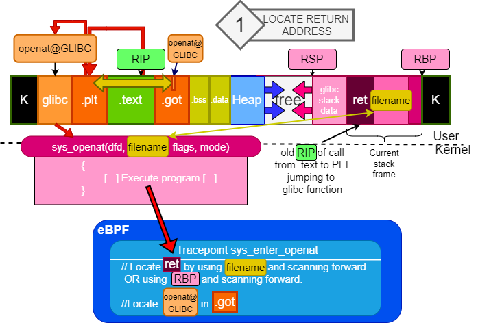


#### Locating key functions for shellcode
The shellcode must be generated dynamically to bypass ASLR and PIE, which change the address of functions such as dlopen() on each program execution.

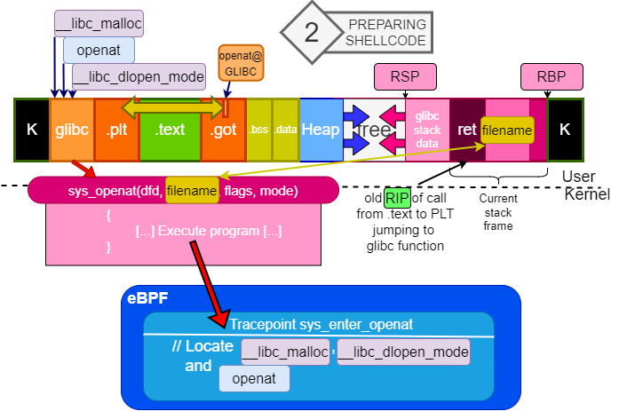


#### Injecting shellcode in a code cave
A code cave can be found by reverse engineering an ELF if ASLR and PIE are off, but usually that is not the case. The eBPF program issues a request to an user space rootkit program that uses the /proc filesystem to locate and write into a code cave at the .text (executable) section.

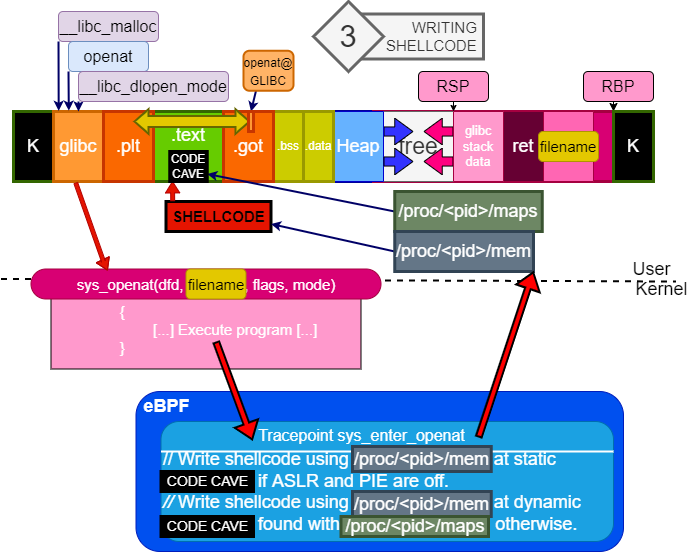

#### Overwriting the GOT section
Depending on whether Partial or Full RELRO are active on the executable, the eBPF program overwrites the GOT section directly or with the /proc filesystem.

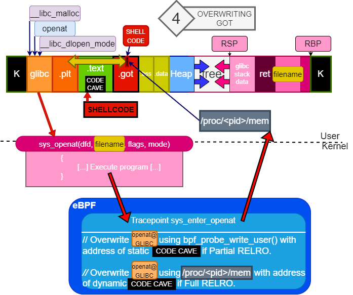

#### Waiting for the next system call
When the next syscall is issued in the hijacked program, the PLT section uses the modified GOT section, hijacking the flow of execution which gets redirected to the shellcode at the code cave. The shellcode is prepared to keep the program from crashing, and calls the malicious library (*src/helpers/lib_injection.so*). This library issues a fork() and spawns a reverse shell with the attacker machine. Afterwards the flow of execution is restored.

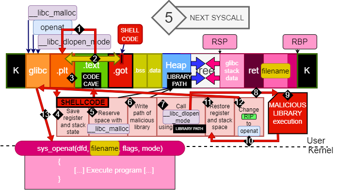


## Backdoor and C2
The backdoor works out of the box without any configuration needed. The backdoor can be controlled remotely using the rootkit client program:

| CLIENT ARGUMENTS | ACTION DESCRIPTION |
| ------------- | ------------- |
| ./injector -c \<Victim IP\> | Spawns a plaintext pseudo-shell by using the execution hijacking module |
| ./injector -e \<Victim IP\> | Spawns an encrypted pseudo-shell by commanding the backdoor with a pattern-based trigger |
./injector -s \<Victim IP\> | Spawns an encrypted pseudo-shell by commanding the backdoor with a multi-packet trigger (of both types) |
./injector -p \<Victim IP\> | Spawns a phantom shell by commanding the backdoor with a pattern-based trigger |
./injector -a \<Victim IP\> | Orders the rootkit to activate all eBPF programs |
./injector -u \<Victim IP\> | Orders the rootkit to detach all of its eBPF programs |
./injector -S \<Victim IP\> | Showcases how the backdoor can hide a message from the kernel (Simple PoC) |
| ./injector -h | Displays help |

### Backdoor triggers

Actions are sent to the backdoor using backdoor triggers, which indicate the backdoor the action to execute depending on the value of the attribute **K3**:

| K3 VALUE | ACTION |
| ------------- | ------------- |
| 0x1F29 | Request to start an encrypted pseudo-shell connection |
| 0x4E14 | Request to start a phantom shell connection |
| 0x1D25 | Request to load and attach all rootkit eBPF programs |
| 0x1D24 | Request to detach all rootkit eBPF programs (except the backdoor’s) |


#### Pattern-based trigger
This trigger hides the command and client information so that it can be recognized by the backdoor, but at the same time seems random enough for an external network supervisor. It is based on the trigger used by the recently discovered NSA rootkit [Bvp47](https://www.pangulab.cn/files/The_Bvp47_a_top-tier_backdoor_of_us_nsa_equation_group.en.pdf).

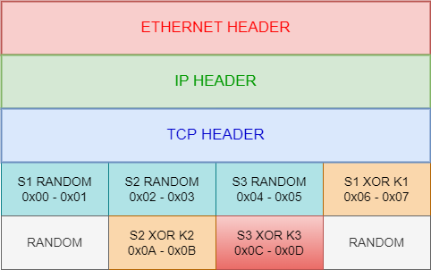

#### Multi-packet trigger
This trigger consists of multiple TCP packets on which the backdoor payload is hidden in the packet headers. This design is based on the CIA [Hive](https://wikileaks.org/vault7/document/hive-DevelopersGuide/hive-DevelopersGuide.pdf) implant described in the Vault 7 leak. The following payload is used:

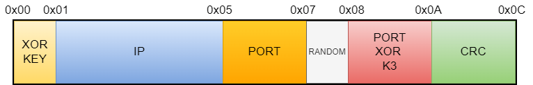

A rolling XOR is then computed over the above payload and it is divided into multiple parts, depending on the mode selected by the rootkit client. TripleCross supports payloads hidden on the TCP sequence number:

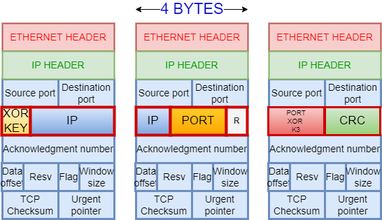

And on the TCP source port:

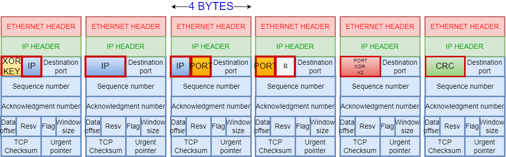

### Backdoor pseudo-shells
The client can establish rootkit pseudo-shells, a special rootkit-to-rootkit client connection which simulates a shell program, enabling the attacker to execute Linux commands remotely and get the results as if it was executing them directly in the infected machine. Multiple pseudo-shells are incorporated in our rootkit:

#### Plaintext pseudo-shell
This shell is generated after a successful run of the execution hijacking module, which will execute a malicious file that establishes a connection with the rootkit client as follows:

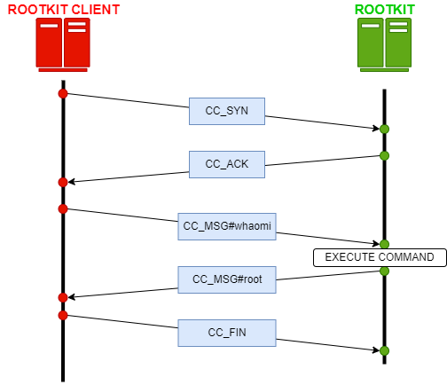
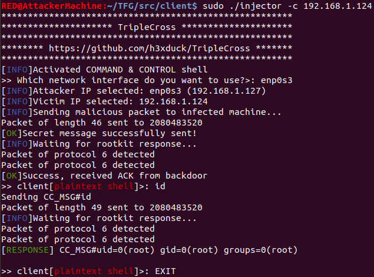

#### Encrypted pseudo-shell
An encrypted pseudo-shell can be requested by the rootkit client at any time, consisting of a TLS connection between the rootkit and the rootkit client. Inside the encrypted connection, a transmission protocol is followed to communicate commands and information, similar to that in plaintext pseudo-shells.

Spawning an encrypted pseudo-shell requires the backdoor to listen for triggers, which accepts either pattern-based triggers or both types of multi-packet trigger:

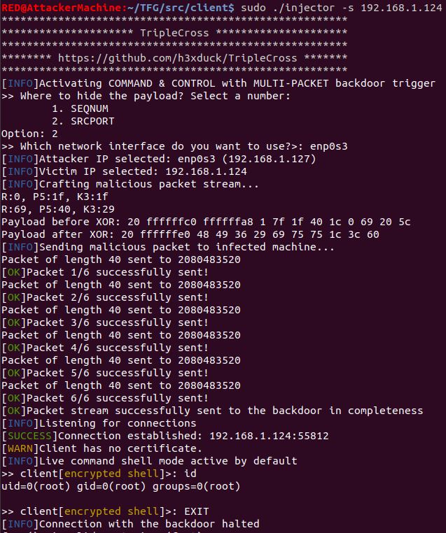
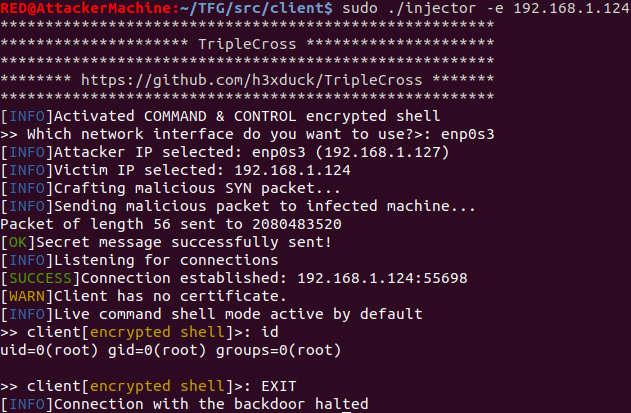

#### Phantom shell
A phantom shell uses a combination of XDP and TC programs to overcome eBPF limitations at the network, specifically that it cannot generate new packets. For this, the backdoor modifies existing traffic, overwriting the payload with the data of the C2 transmission. The original packets are not lost since TCP retransmissions send the original packet (without modifications) again after a short time.

The following protocol illustrates the traffic during the execution of a command using a phantom shell:
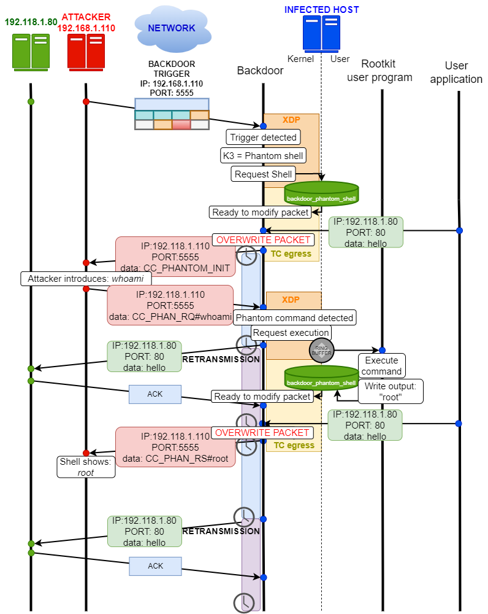

A phantom shell is requested by the rootkit client which issues a command to be executed by the backdoor:

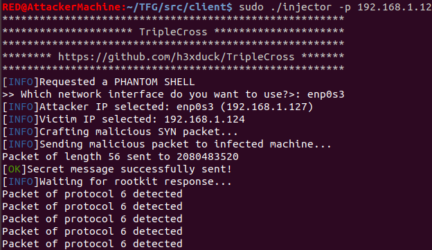

After the infected machine sends any TCP packet, the backdoor overwrites it and the client shows the response:

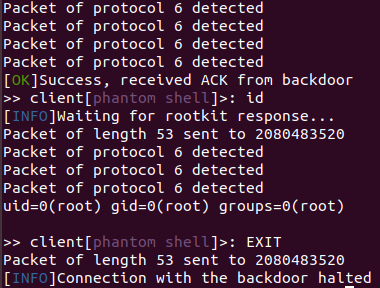


## Execution hijacking module
In principle, an eBPF program cannot start the execution of a program by itself. This module shows how a malicious rootkit may take advantage of benign programs in order to execute malicious code at the user space. This module achieves two goals:
* Execute a malicious user program taking advantage of other program's execution.
* Be transparent to the user space, that is, if we hijack the execution of a program so that another is run, the original program should be executed too with the least delay.

This module works by hijacking the sys_execve() syscall, modifying its arguments so that a malicious program (*src/helpers/execve_hijack.c*) is run instead. This modification is made in such a way that the malicious program can then execute the original program with the original arguments to avoid raising concerns in the user space. The following diagram summarizes the overall functionality:

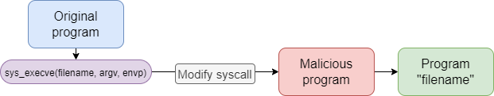

The arguments of the original sys_execve() call are modified in such a way that the original arguments are not lost (using argv[0]) so that the original program can be executed after the malicious one:

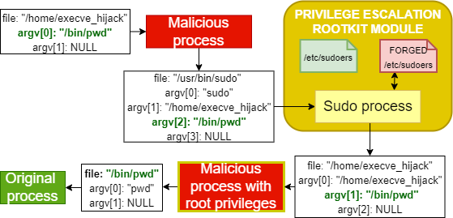

We have incorporated a sample test program (*src/helpers/simple_execve.c*) for testing the execution hijacking module. The module can also hijack any call in the system, depending on the configuration:

| FILENAME | CONSTANT | DESCRIPTION |
| ------------- | ------------- | ------------- |
| src/common/constants.h | PATH_EXECUTION_HIJACK_PROGRAM | Location of the malicious program to be executed upon succeeding to execute a sys_execve call |
| src/common/constants.h | EXEC_HIJACK_ACTIVE | Deactivate (0) or activate (1) the execution hijacking module |
| src/common/constants.h | TASK_COMM_RESTRICT_HIJACK_ACTIVE | Hijack any sys_execve call (0) or only those indicated in TASK_COMM_NAME_RESTRICT_HIJACK (1) |
| src/common/constants.h | TASK_COMM_NAME_RESTRICT_HIJACK | Name of the program from which to hijack sys_execve calls |

After a successful hijack, the module will stop itself. The malicious program *execve_hijack* will listen for requests of a plaintext pseudo-shell from the rootkit client.

## Rootkit persistence
After the infected machine is rebooted, all eBPF programs will be unloaded from the kernel and the userland rootkit program will be killed. Moreover, even if the rootkit could be run again automatically, it would no longer enjoy the root privileges needed for attaching the eBPF programs again. The rootkit persistence module aims to tackle these two challenges:
* Execute the rootkit automatically and without user interaction after a machine reboot event.
* Once the rootkit has acquired root privileges the first time it is executed in the machine, it must keep them even after a reboot.

TripleCross uses two secret files, created under *cron.d* and *sudoers.d*, to implement this functionality. These entries ensure that the rootkit is loaded automatically and with full privilege after a reboot. These files are created and managed by the *deployer&#46;sh* script:

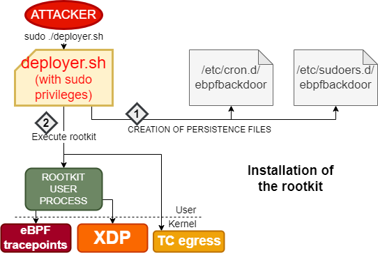
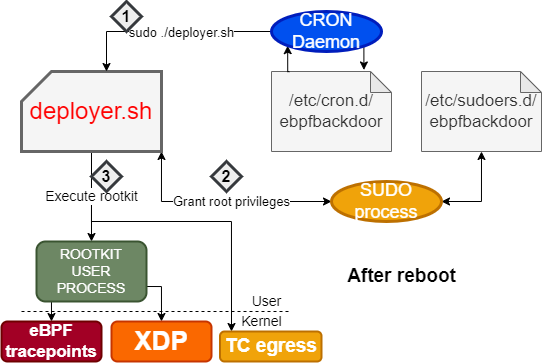

The script contains two constants that must be configured for the user to infect on the target system:

| SCRIPT | CONSTANT | DESCRIPTION |
| ------------- | ------------- | ------------- |
| src/helpers/deployer.sh | CRON_PERSIST | Cron job to execute after reboot |
| src/helpers/deployer.sh | SUDO_PERSIST | Sudo entry to grant password-less privileges |

## Rootkit stealth
The persistence module is based on creating additional files, but they may get eventually found by the system owner or by some software tool, so there
exists a risk on leaving them in the system. Additionally, the rootkit files will need to be stored at some location, in which they may get discovered.

Taking the above into account, the stealth module provides the following functionality:
* Hide a directory completely from the user (so that we can hide all rootkit files inside).
* Hide specific files in a directory (we need to hide the persistence files, but we cannot hide the *sudoers.d* or *cron.d* directories completely, since they belong to the normal system functioning).

The files and directories hidden by the rootkit can be customized by the following configuration constants:

| FILENAME | CONSTANT | DESCRIPTION |
| ------------- | ------------- | ------------- |
| src/common/constants.h | SECRET_DIRECTORY_NAME_HIDE | Name of directory to hide |
| src/common/constants.h | SECRET_FILE_PERSISTENCE_NAME | Name of the file to hide |

By default, TripleCross will hide any files called "*ebpfbackdoor*" and a directory named "*SECRETDIR*". This module is activated automatically after the rootkit installation.

The technique used for achieving this functionality consists of tampering with the arguments of the sys_getdents() system call:

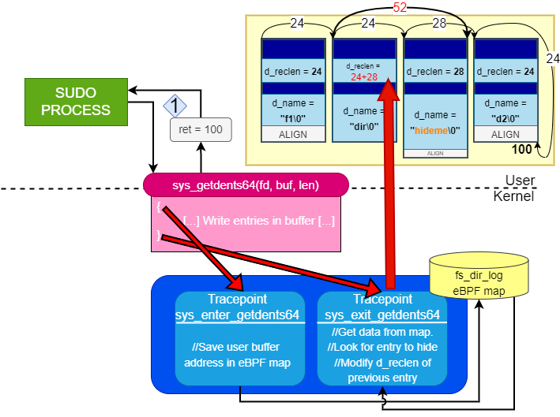


## License
The TripleCross rootkit and the rootkit client are licensed under the GPLv3 license. See [LICENSE](https://github.com/h3xduck/TripleCross/blob/master/LICENSE).

The [RawTCP_Lib](https://github.com/h3xduck/RawTCP_Lib) library is licensed under the MIT license.

The original thesis document and included figures are released under [Creative Commons BY-NC-ND 4.0](https://creativecommons.org/licenses/by-nc-nd/4.0/).


